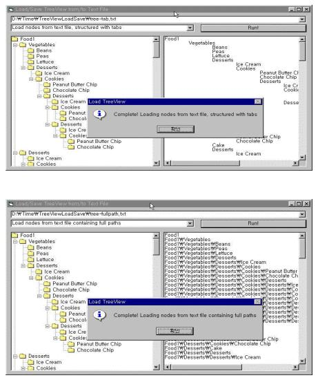



## Load/Save TreeView from/to Text File

### Description

Loads treeview nodes from a text file.

Saves treeview nodes to a text file.

Saves them as a file containing tab-structured nodes, or as a file containing full paths delimited with a delimiter.

Loads nodes from a saved file, containing full paths of nodes or structured with tabs.

(See screen shot)
 
### More Info
 

             |
---                |---
**Submitted On**   |2002-03-06 06:21:22
**By**             |[S\.Y\. Kim](https://github.com/Planet-Source-Code/PSCIndex/blob/master/ByAuthor/s-y-kim.md)
**Level**          |Beginner
**User Rating**    |4.9 (39 globes from 8 users)
**Compatibility**  |VB 6\.0
**Category**       |[OLE/ COM/ DCOM/ Active\-X](https://github.com/Planet-Source-Code/PSCIndex/blob/master/ByCategory/ole-com-dcom-active-x__1-29.md)
**World**          |[Visual Basic](https://github.com/Planet-Source-Code/PSCIndex/blob/master/ByWorld/visual-basic.md)
**Archive File**   |[Load\_Save\_59588352002\.zip](https://github.com/Planet-Source-Code/s-y-kim-load-save-treeview-from-to-text-file__1-32367/archive/master.zip)

